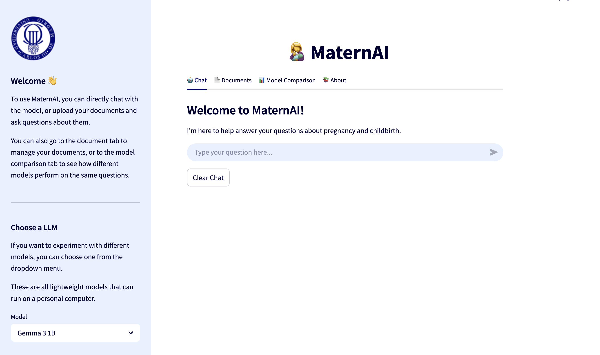

# 👩‍🍼 MaternAI

Duarte Moura, Alejandro Merino, Sandra Eizaguerri and Carlos Garijo  
Universidad Carlos III de Madrid





## Overview

MaternAI is a Retrieval-Augmented Generation (RAG) chatbot focused on providing accurate, evidence-based information on maternal and newborn health. It grounds its answers in authoritative documents, provides citations, and abstains from answering when insufficient evidence exists. The system supports multilingual queries and is designed for use by healthcare professionals and the general public.

## Features

- Retrieval-augmented generation for grounded, trustworthy answers
- Citations with clickable sources
- Multilingual query support (automatic language detection)
- Document upload and management via UI
- Conversation history and memory
- Export conversations as PDF
- Hybrid retrieval (dense + sparse + re-ranking)

## Workflow 


## Installation

1. Open an empty folder and run
```sh
git clone git@github.com:dasc-uc3m/nlp-project.git .
```

2. Create your virtual environment. I use virtualenv for this (in Linux) e.g.:
```sh
virtualenv -p python3 .venv
source .venv/bin/activate
```
but you can use `conda`, `uv` or whatever you want!

3. Install the dependencies:
```sh
pip install -r requirements.txt
```

## Usage
For launching automatically this application, a bash file (Linux) has been provided that runs automatically the different parts of this project.
To run it, first open `run.sh` and substitute the path to your virtual environment in the variable called `VENV_PATH`. Then run `bash ./run.sh`.

If your virtual environment is handled through `conda` or you are using windows or MAC, you should run manually the different parts. In this case, follow these steps:

1. Go to the root path of this repository.
2. Make sure that you have activated your virtual environment.
3. Run `docker compose up --build` to launch the local LLM.
4. Open a new terminal and repeat steps 1 and 2. Then run `python3 app/chatbot_app.py` to launch the Flask API that communicates with the backend of the project.
5. Open (again) a new terminal and repeat steps 1 and 2. Then run `streamlit run ui/streamlit_app.py` to launch the frontend. A window should automatically open.

## Frontend

To launch the user interface, run:
```sh
streamlit run app.py
```
You can then upload documents, ask questions, and view citations in your browser.

## LLM service

In `llm/` folder there is the definition of the LLM and a REST API that run in the docker to allow LLM inference.
These files must not be modified! Think of them as if they were an external LLM to which we will make requests, but
with everything coded outside of it. All the logic and coding (RAG, prompt formatting, chatbot structure and methods...)
are allocated in the `src/` folder. The LLM loaded in the docker just receives a requests and returns an answer!

To start the LLM run in a terminal:

```sh
docker compose up --build
```

Once it starts, it is possible to make inference to the LLM from wherever you want. To make inference, the port defined in `docker-compose.yml` is exposed and sending data is possible by making POST requests to the `/generate` method, but you don't have to worry about this as an interface to this API is coded in the `LocalLLM` class in `src/chatbot.py`.

## Main scripts, classes and functions

The core of this ChatBot project is allocated in the `src/` folder.
Here there are two main scripts:
- `chatbot.py`: In this script, the ChatBot class is defined and it is the main class that performs the prompt formatting logic, llm requests, etc.
- `db.py`: In this script the vector database is programmed and all its correspondant functions.

### ChatBot

The ChatBot class performs different operations. Through the method `.infer()` it sends a message to the LLM that is constructed given a certain context and some memory. The memory is an external class that provides the necessary functionality to save and cache the conversation that is being produced between the user and the AI.

The ChatBot class also has an attribute that represents the retrieved context. This context comes from the documents of the database and, once it is retrieved, it is loaded in this attribute to, then, form the final prompt. To handle this context there are two methods: `initialize_context()` and `remove_context()`.

Finally, a method `retrieve_context_from_db()` to which the vector database is passed as an argument, performs the search given a certain query and loads the most relevant documents as the ChatBot context.

For more info, read the source code comments and docstrings.

### Vector Database

In `db.py` there is a class that represents the vector Database. The selected database is `Chroma`. This class has two main methods: `upload_document()` and `retrieve_context()`. The first one receives a path to a single document (for now just pdf documents), chunks it, vectorizes it and uploads the chunks embeddings to the database.
The second one retrieves the context by searching the most similar chunks given a certain query.

## License

This project is licensed under the MIT License.

## Acknowledgements

- World Health Organization (WHO) and Healthy Newborn Network (HNN) for source documents
- Hugging Face Transformers, Chroma, LangChain, Streamlit, and other open-source tools
