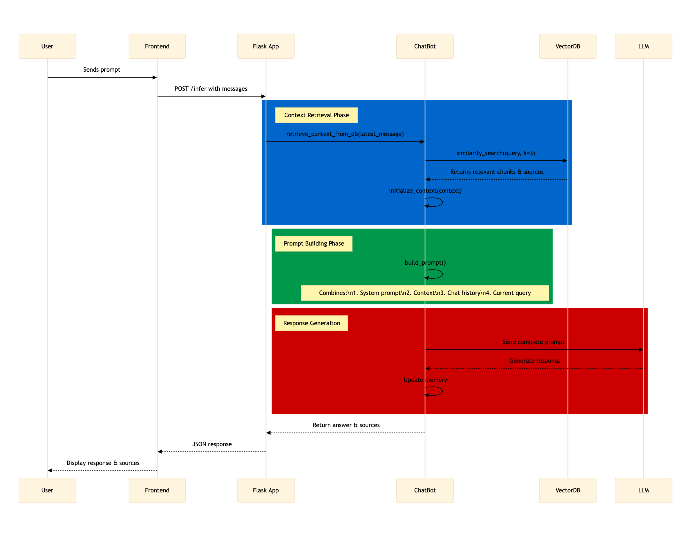

# 👩‍🍼 MaternAI
Duarte Moura, Alejandro Merino, Sandra Eizaguerri and Carlos Garijo

Universidad Carlos III de Madrid


# Workflow 





## Installation
1. Open an empty folder and run
```sh
git clone git@github.com:dasc-uc3m/nlp-project.git .
```

2. Create your virtual environment. I use virtualenv for this (in Linux) e.g.:
```sh
virtualenv -p python3 .venv
source .venv/bin/activate
```
but you can use `conda`, `uv` or whatever you want!

3. Install the dependencies:
```sh
pip install -r requirements.txt
```

## LLM service
In `llm/` folder there is the definition of the LLM and a REST API that run in the docker to allow LLM inference.
These files must not be modified! Think of them as if they were an external LLM to which we will make requests, but
with everything coded outside of it. All the logic and coding (RAG, prompt formatting, chatbot structure and methods...)
are allocated in the `src/` folder. The LLM loaded in the docker just receives a requests and returns an answer!

To start the LLM run in a terminal:

```sh
docker compose up --build
```

Once it starts, it is possible to make inference to the LLM from wherever you want. To make inference, the port defined in `docker-compose.yml` is exposed and sending data is possible by making POST requests to the `/generate` method, but you don't have to worry about this as an interface to this API is coded in the `LocalLLM` class in `src/chatbot.py`.

## Main scripts, classes and functions
The core of this ChatBot project is allocated in the `src/` folder.
Here there are two main scripts:
- `chatbot.py`: In this script, the ChatBot class is defined and it is the main class that performs the prompt formatting logic, llm requests, etc.
- `db.py`: In this script the vector database is programmed and all its correspondant functions.

### ChatBot
The ChatBot class performs different operations. Through the method `.infer()` it sends a message to the LLM that is constructed given a certain context and some memory. The memory is an external class that provides the necessary functionality to save and cache the conversation that is being produced between the user and the AI.

The ChatBot class also has an attribute that represents the retrieved context. This context comes from the documents of the database and, once it is retrieved, it is loaded in this attribute to, then, form the final prompt. To handle this context there are two methods: `initialize_context()` and `remove_context()`.

Finally, a method `retrieve_context_from_db()` to which the vector database is passed as an argument, performs the search given a certain query and loads the most relevant documents as the ChatBot context.

For more info, read the source code comments and docstrings.

### Vector Database
In `db.py` there is a class that represents the vector Database. The selected database is `Chroma`. This class has two main methods: `upload_document()` and `retrieve_context()`. The first one receives a path to a single document (for now just pdf documents), chunks it, vectorizes it and uploads the chunks embeddings to the database.
The second one retrieves the context by searching the most similar chunks given a certain query.
